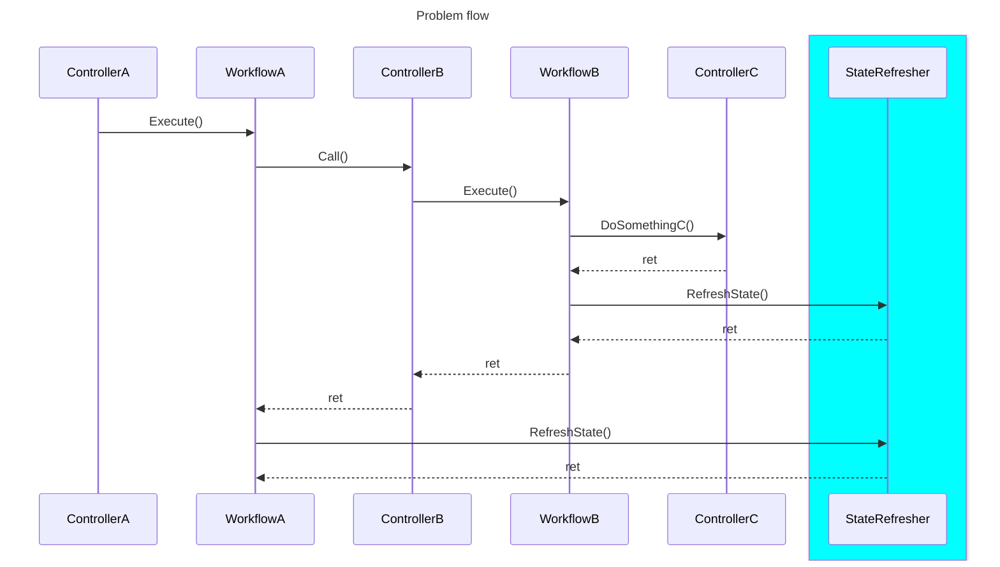
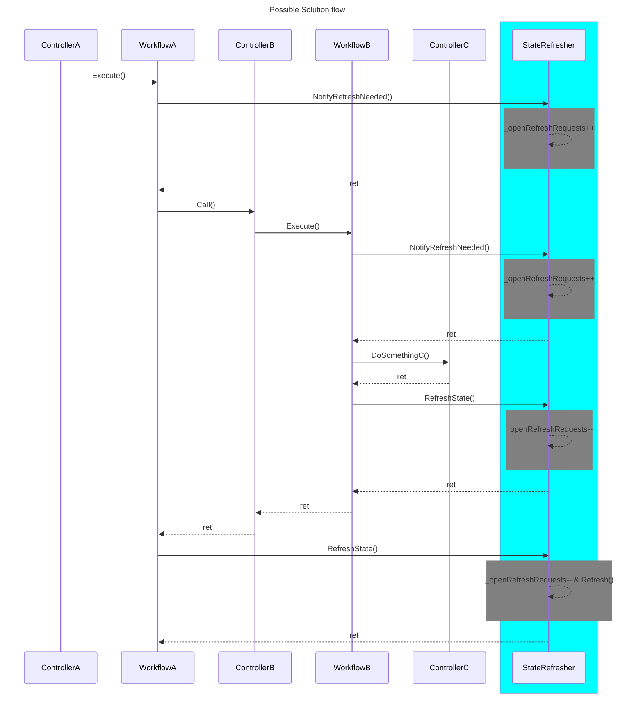

# refresh-only-once
Idea of a mechanism that manage multiple refresh requests in a way that only a single refresh will be executed at the end of all requests.


## How to run in GitHub Codespaces

1. Open the repository in GitHub Codespaces.
2. Navigate to the `/RefreshOnlyOnce` directory.
3. Open a terminal in the Codespace.
4. Run the following command to restore the dependencies:

```bash
dotnet run --verbosity quiet
```


### Demo


## Sequence Flow
### Problem flow


### Possible Solution flow
